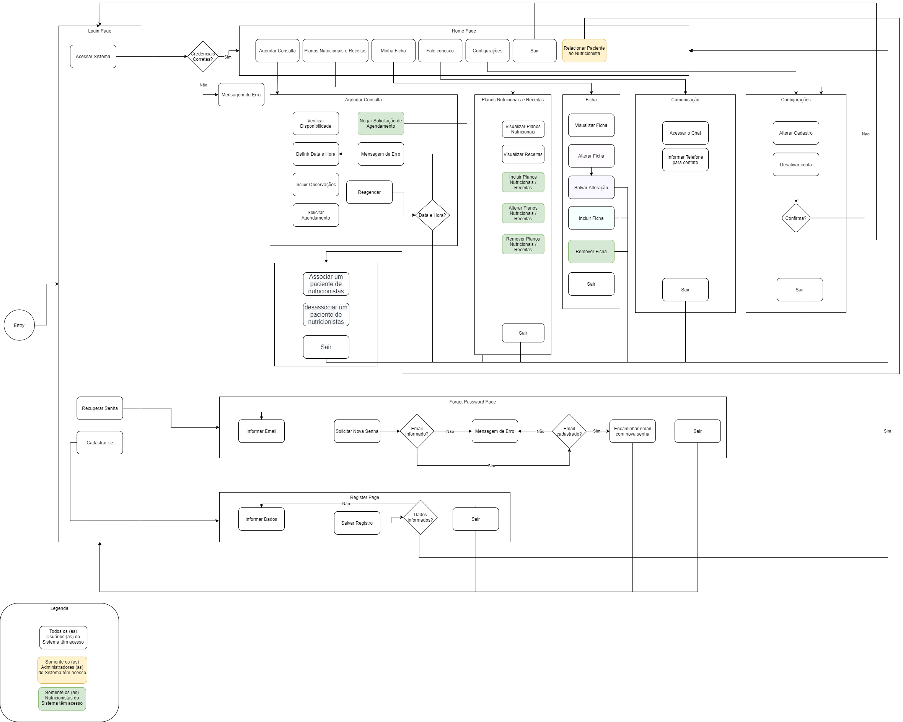
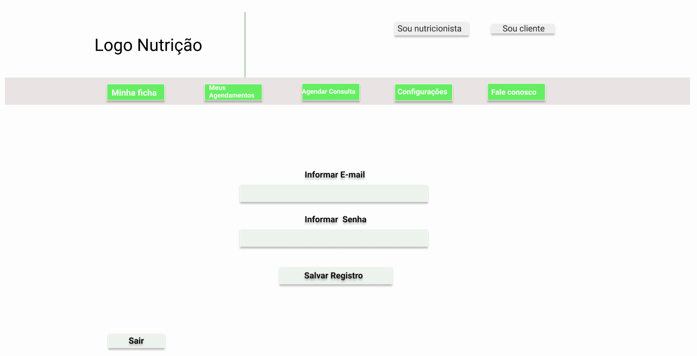
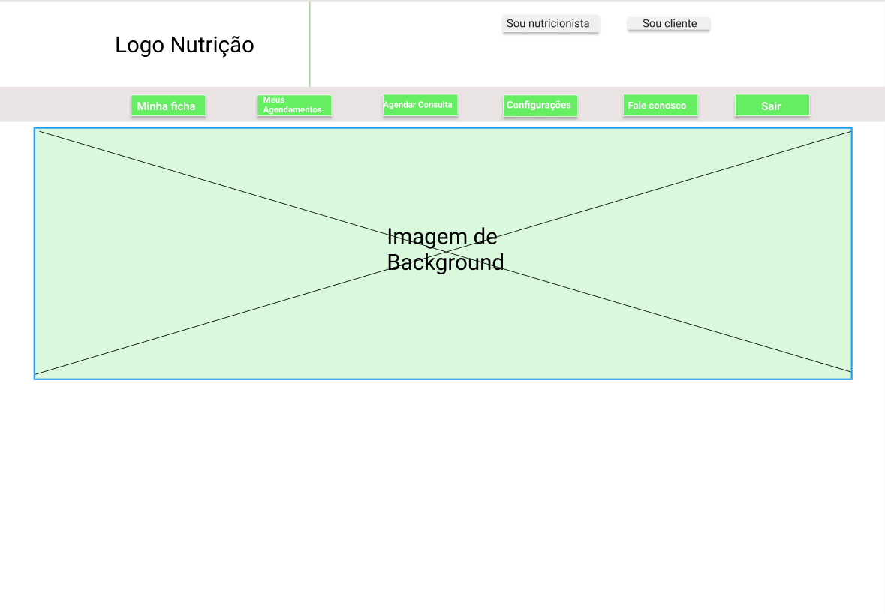
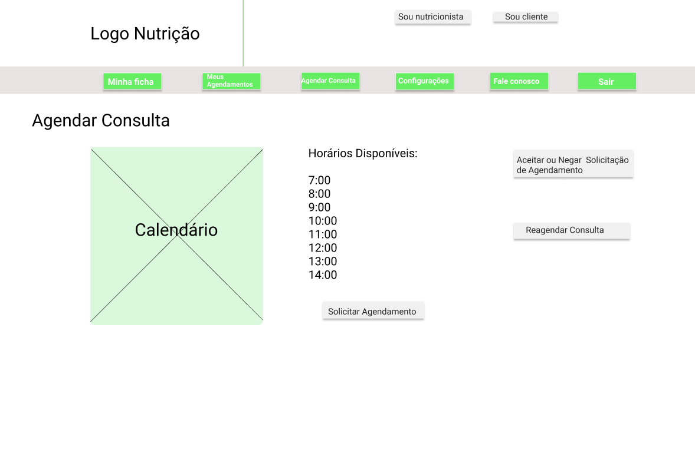
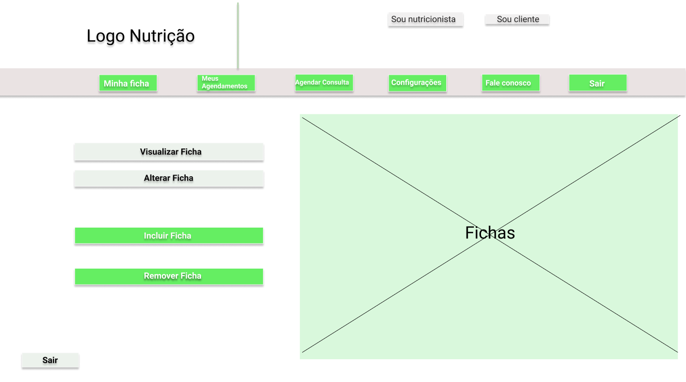
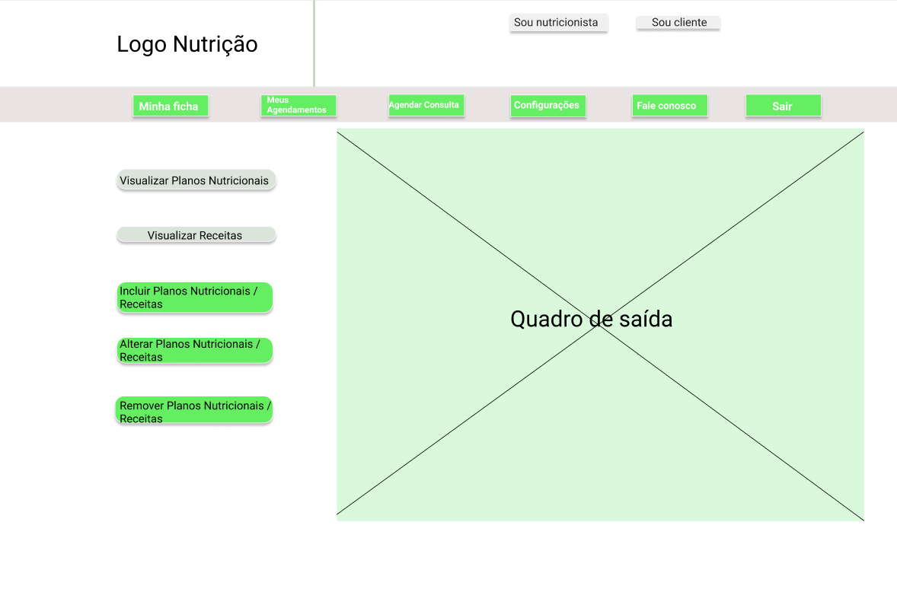
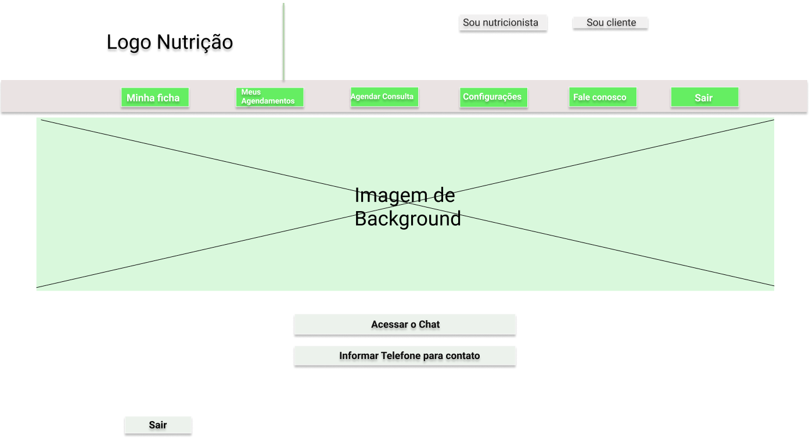
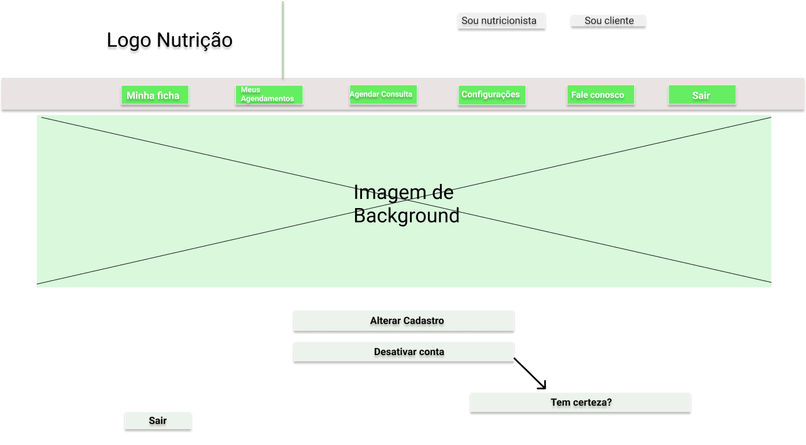
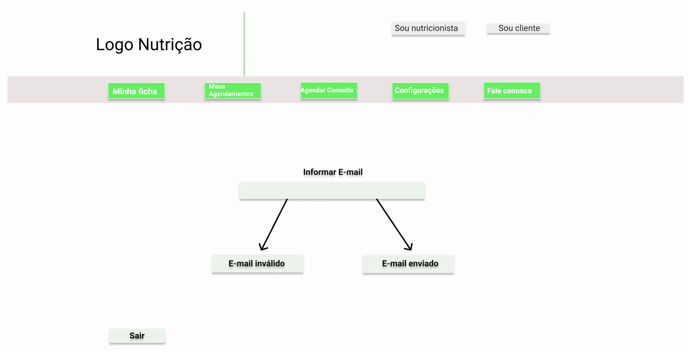

# Projeto de Interface

## User Flow

O fluxo de usuário (User Flow) abaixo mapeia todo fluxo de telas do site a ser desenvolvido durante a disciplina. Nele são demonstrados os caminhos e possíveis ações que o usuário poderá tomar.

## Wireframes

São protótipos usados em design de interface para sugerir a estrutura de um site web e seu relacionamentos entre suas páginas. Um wireframe web é uma ilustração semelhante do layout de elementos fundamentais na interface.

### Link para o prototipo interativo
https://www.figma.com/file/SY8HRPJLuDYdHA0RAX2JLZ/Nutri%C3%A7%C3%A3o-1?node-id=39%3A318
 
 
### Cadastro
 

### Home
  
  
### Agendar Consulta
 

### Ficha
 

### Planos
 

### Comunicação
  

### Configurações
  

### Esqueceu E-mail
  

