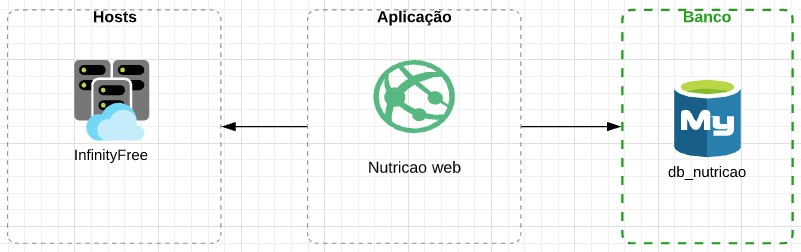
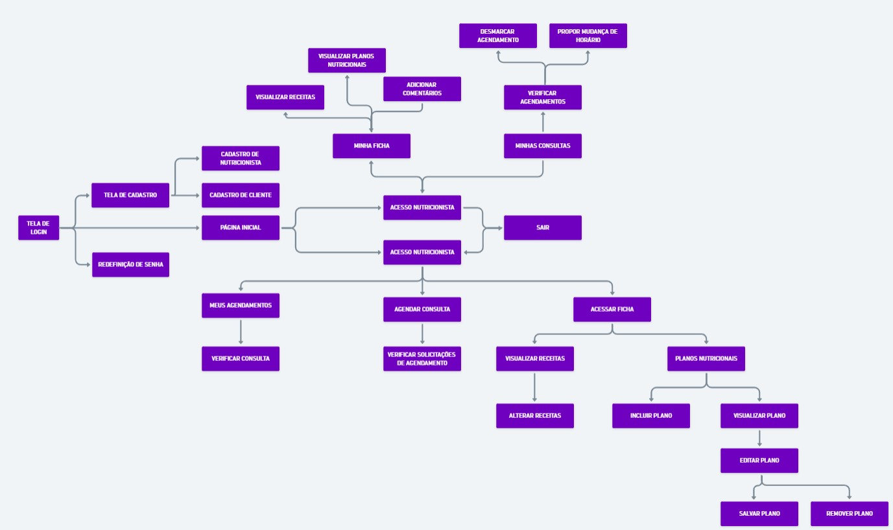
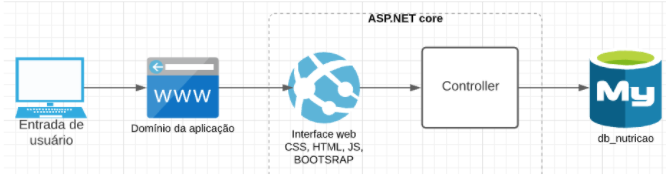

# Arquitetura da Solução

Pré-requisitos: <a href="3-Projeto de Interface.md"> Projeto de Interface</a>

Definição de como o software é estruturado em termos dos componentes que fazem parte da solução e do ambiente de hospedagem da aplicação.

## Diagrama de componentes

Diagrama que permite a modelagem física de um sistema, através da visão dos seus componentes e relacionamentos entre os mesmos.

Exemplo: 

Os componentes que fazem parte da solução são apresentados na figura abaixo.

A solução implementada conta com os seguintes módulos:
- **Aplicação** - Interface web que será acessada pelo usuário. 
- **Banco** - Estrutura responsável por gerir a persistência dos dados.
- **Hospedagem** - Host responsável pela publicação da aplicação em um domínio público para.

## User flow

*Link*: https://whimsical.com/Tu9hcsAWL8UjxTVHNkMSK

## Tecnologias Utilizadas
Para desenvolvimento do programa serão utilizadas as tecnologias listadas abaixo:

-*ASP.NET core*

-JavaScript

-CSS

-HTML

-Bootstrap

-Visual studio

-MySQL

## Hospedagem
A hospedagem vai ser realizada em primeira instância através do sistema da InfinityFree, um serviço gratuito que possui armazenamento ilimitado, com SSL gratuito.

Para hospedagem será criado uma conta na plataforma, nela criaremos um domínio “nutrimaiss.epizy.com", que está disponível para uso. Concluído todo o desenvolvimento e construção do site, é necessário realizar o upload pelo método de FilleZila - FTP (File Transfer Protocol), sincronizando com o painel da Infinity, com todos os arquivos construidos e necessários para o funcionamento do site para a pasta htdocs. Referente ao banco de dados, através do phpMyAdmin será realizado um backup do MySQL também pelo painel. 

Após todo o procedimento de uploads dos arquivos decorrerá então a verificação e validação do funcionamento do site para uso das atividades normalmente.   

> **Links Úteis**: 
>
> - [Website com GitHub Pages](https://pages.github.com/)
> - [Programação colaborativa com Repl.it](https://repl.it/)
> - [Getting Started with Heroku](https://devcenter.heroku.com/start)
> - [Publicando Seu Site No Heroku](http://pythonclub.com.br/publicando-seu-hello-world-no-heroku.html)
