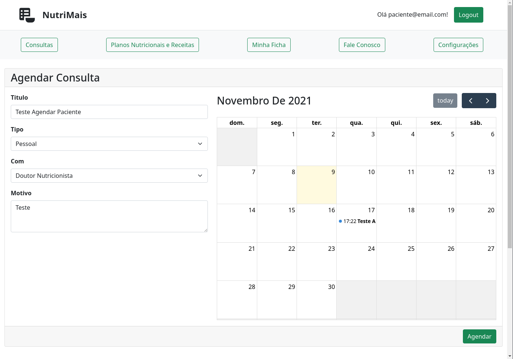
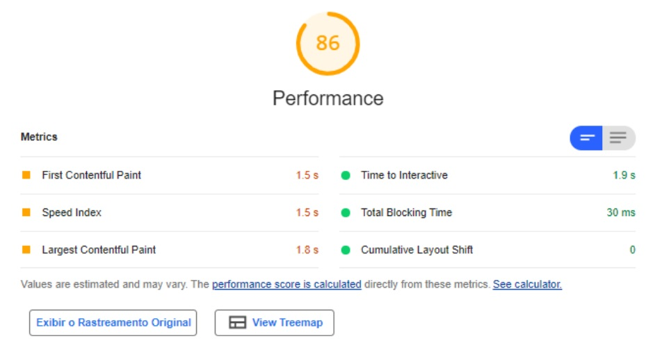
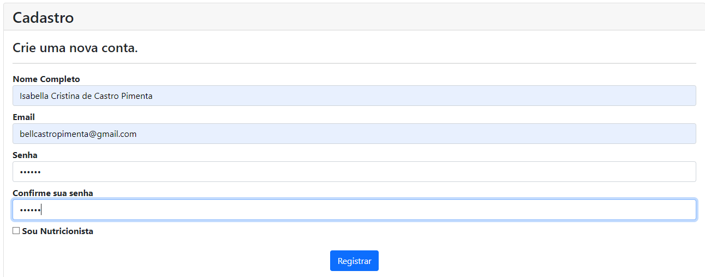
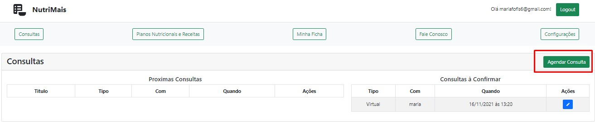
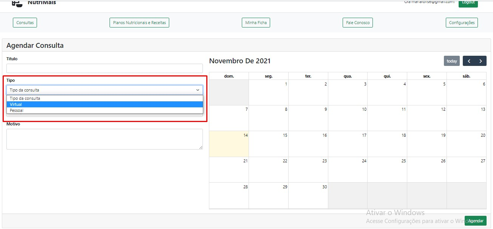

# Registro de Testes de Software

## Relatorio de Testes

### T-001 Teste de Agendar consulta como paciente;

### Artefatos

**1. Criar um usuario paciente**

**2. Criar um usuario nutricionista**

**3. Vincular usuario paciente ao usuario nutricionista**

**4. Logar com usuario paciente**

**5. Clicar em "Agendar Consulta" na pagina de consultas**

**6. Verificar que no campo "Com" aparecer apenas seu nutricionista**

**7. Preencher os campos de "Titulo", "Com", "Tipo" e "Descrição"**

**8. Selecionar uma data disponivel no calendario**

**9. Submeter formulario**

**10. Verificar se consulta se encontra em "A confirmar" na conta do paciente**

**11. Logar com o usuario nutricionista**

**12. Verificar se a consulta se encontra em "A confirmar" em sua conta e se é possivel que ele confirme essa consulta**

### Resultado

O teste foi um sucesso! Embora foi notado que o front-end não esta fazendo a mesma validação que o backend.

------

### T-002 Teste de Confimar que o sistema esta criando links do google meet;

### Artefatos

**1. Criar um usuario paciente**

**2. Criar um usuario nutricionista**

**3. Vincular usuario paciente ao usuario nutricionista**

**4. Logar com usuario paciente**

**5. Clicar em "Agendar Consulta" na pagina de consultas**

**6. Preencher os campos de "Titulo", "Com", "Tipo" e "Descrição"**

**7. Selecionar uma data disponivel no calendario**

**8. Submeter formulario**

**9. Verificar se consulta se encontra em "A confirmar" na conta**

**10. Logar com o usuario paciente**

**11. Verificar se a consulta se encontra em "A confirmar" em sua conta e se é possivel que ele confirme essa consulta**

**12. Confirmar consulta**

**13. Verificar se na pagina de detalhes da consulta esteja disponivel o link**

**14. Logar com o nutricionista verificar se na pagina de detalhes desta mesma consulta mostra o mesmo link**

### Resultado

O teste foi um sucesso! O link apareceu devidamente para ambos, foi notado entretando que o sistema não comunica que esta realizando
uma ação quando esta confirmando uma consulta, uma melhoria para o futuro é talvez mostrar um pop up dizendo que está "Processando"

----------------------------

## Avaliação

Cada ponto forte e fraco de cada teste foi ressaltado em seu reespectivo teste na area de *Resultado*

### T-003 Teste para processar requisições do usuário em no máximo 3s

## Artefatos

**1. Acessar o site.**
Página: Consultas - NutriMais (nutri-mais.herokuapp.com)

**2. Executar 1 requisição.**
(Create)

**3. Avaliar tempo para processamento das requisições.**

Com esse relatório gerado através do Lighthouse 8.4.0 pode-se observar que o tempo para a página tornar-se iterativa é de 1.9s. Este tempo refere-se ao tempo de carregamento da página. 

Tempo para o evento de Create de 153.60 ms.

**1. Acessar o site.**
Página: Fale Conosco - NutriMais (nutri-mais.herokuapp.com)

**2. Executar 1 requisição.**
**3. Avaliar tempo para processamento das requisições.**

Tempo para o evento de carregamento da página de 0.8s.

**1. Acessar o site.**
Página: Home Page - NutriMais (nutri-mais.herokuapp.com)
**2. Avaliar tempo para processamento das requisições.**

Tempo para o evento de carregamento da página de 0.8s.

Tempo para a renderização da imagem da página de Home em 2.92s.

Mesma página no smartphone (teste realizado por meio da ferramenta thinkwithgoogle). 

### Resultado

O teste foi bem sucessido e o tempo para os testes foram inferiores a 3s.

### T-004 Teste do Usuário Logar no Sistema;

### Artefatos

**1. Pagina Inicial**

**2. Criar um usuario paciente**

**3. Criar um usuario nutricionista**

**4. Logar**

### Resultado

O teste foi bem sucessido e o usuário foi logado no sistema.

### T-005 Teste para cadastro de agendamento do Nutricionista;

### Artefatos

**1. Pagina Consultas**

**2. Pagina Consultas**

**3. Pagina Cadastro Agendamento**

**4. Verificação tipo consulta**

**5. Verificação Paciente**

**6. Escolha de horário Agendamento**

**7. Envio dos dados**

### Resultado

Realizado o teste foi validado o bom funcionamento de todas as estruturas, de dados e calendário, além do funcionamento de relacionamento entre o cliente e o nutricionist, podendo ser concluído como bem sucessido e o consultada bem cadastrada no sistema.
